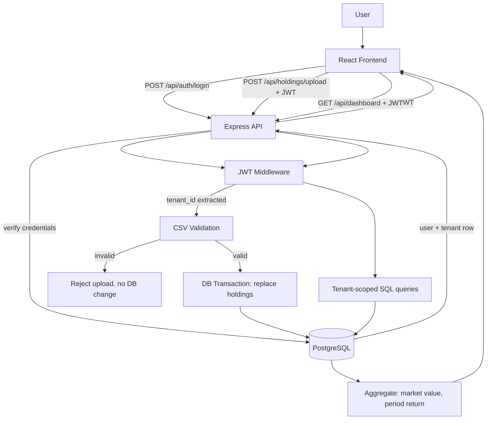
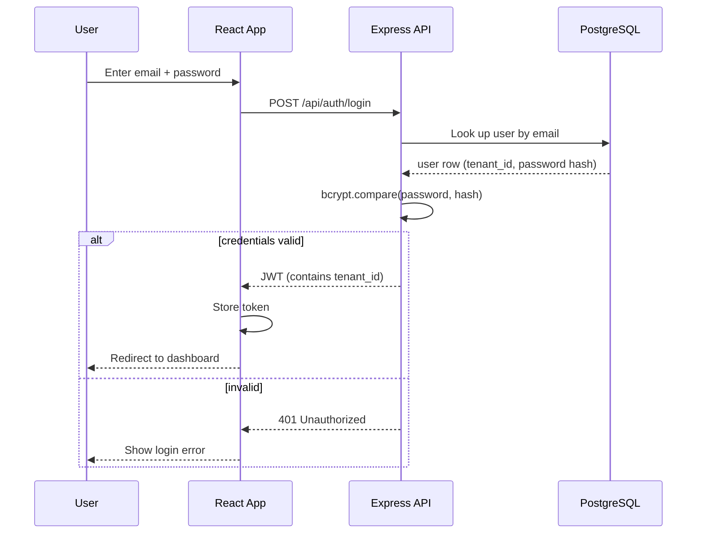
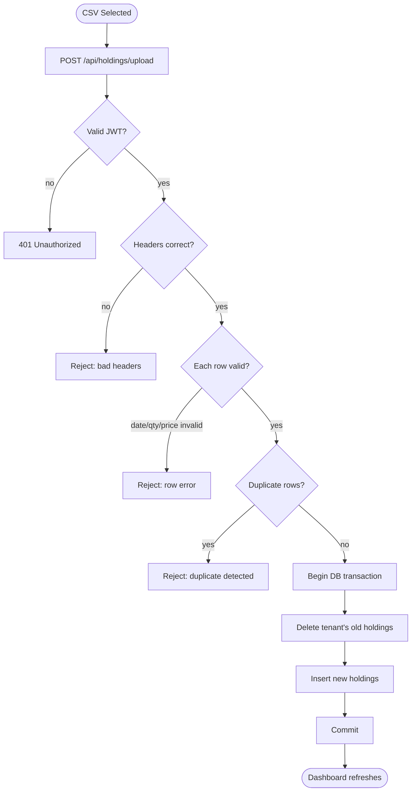
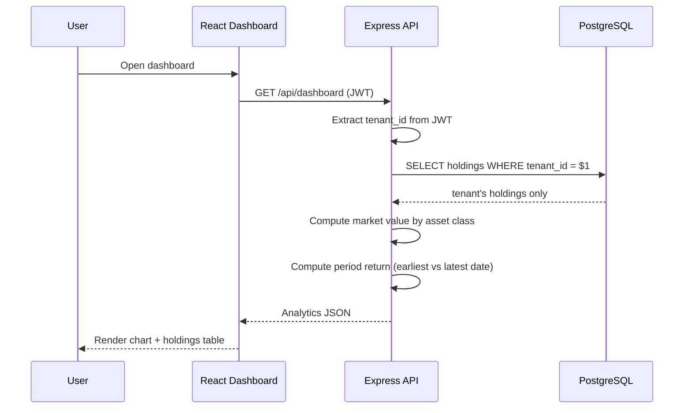

# Northstar Portfolio

A multi-tenant investment portfolio tracker. Users log in, upload their holdings as a CSV, and the backend validates, stores, and turns that data into portfolio analytics rendered on a dashboard.

The app combines React, TypeScript, Express, PostgreSQL, JWT auth, and Docker Compose. Every request is scoped to the authenticated user's tenant, so the core engineering focus is **secure multi-tenant isolation**, **CSV validation**, and **server-side portfolio calculations**.

---

## Screenshots

**Login**


**Dashboard**


---

## Key Features

### Multi-Tenant Data Isolation

Every authenticated request carries a `tenant_id` inside its JWT. The backend never trusts a tenant value supplied by the frontend — every query is scoped server-side:

```sql
SELECT * FROM holdings WHERE tenant_id = $1;
```

### CSV Ingestion Pipeline

Uploads go through header checks, per-row validation, and duplicate detection before anything touches the database. Validation is all-or-nothing: one bad row rejects the whole file.

### Atomic Replace-on-Upload

A new upload replaces the tenant's existing holdings rather than appending to them — deterministic behavior, no accidental duplication from re-uploads.

### Server-Side Portfolio Analytics

Market value and period return are computed in the backend/database layer, not the browser, so the frontend only ever displays numbers from a single source of truth.

### JWT Authentication

Two seeded users, each in a different tenant, log in via a stateless JWT flow. Passwords are hashed with bcrypt; nothing is stored in plaintext.

### Dockerized Runtime

`docker compose up --build` brings up PostgreSQL, the Express API, and the React frontend together — no manual service setup required.

---

## System Architecture



---

## Authentication Flow



---

## CSV Upload Flow



A row is a duplicate if it matches another row on `date + ticker + asset_class + quantity + price`.

---

## Dashboard / Analytics Flow



---

## Core Modules

| Area | Responsibility |
| --- | --- |
| `backend/src/routes/` | Auth, upload, and dashboard route handlers |
| `backend/src/middleware/` | JWT verification, tenant context extraction |
| `backend/src/services/` | CSV parsing, validation, portfolio calculations |
| `backend/src/db/` | Parameterized queries, transaction handling |
| `backend/init.sql` | Schema creation + seeded users/tenants |
| `frontend/src/pages/` | Login and dashboard views |
| `frontend/src/components/` | Chart, holdings table, upload form |
| `frontend/src/services/` | API client, token storage |
| `docker-compose.yml` | Orchestrates frontend, backend, and PostgreSQL |

---

## Data Model

```text
tenants
├── id
└── name

users
├── id
├── tenant_id  → tenants.id
├── email
└── password_hash

holdings
├── id
├── tenant_id  → tenants.id
├── date
├── ticker
├── asset_class
├── quantity
└── price
```

`tenant_id` on `holdings` is the isolation boundary — every read and write is filtered by it.

---

## Portfolio Calculations

**Market value**
```
market_value = quantity × price
   e.g. 100 × $180 = $18,000
```

**Period return**
```
period_return = (end_value − start_value) / start_value

   start_value = total holdings value on the earliest date
   end_value   = total holdings value on the latest date

   e.g. ($55,000 − $50,000) / $50,000 = 10%
```

---

## Tech Stack

| Category | Technologies | Purpose |
| --- | --- | --- |
| Frontend | React 19, TypeScript, Vite, Tailwind CSS | Dashboard UI |
| Backend | Node.js, Express, TypeScript | REST API, business logic |
| Database | PostgreSQL 15 | Tenant-scoped relational storage |
| Auth | JWT, bcrypt | Stateless auth, password hashing |
| Deployment | Docker, Docker Compose | Reproducible local environment |

---

## Repository Structure

```text
northstar-portfolio-takehome/
├── backend/
│   ├── src/
│   │   ├── routes/
│   │   ├── middleware/
│   │   ├── services/
│   │   └── db/
│   ├── init.sql
│   ├── package.json
│   └── Dockerfile
├── frontend/
│   ├── src/
│   │   ├── pages/
│   │   ├── components/
│   │   └── services/
│   ├── package.json
│   └── Dockerfile
├── sample_good.csv
├── sample_dirty.csv
├── docker-compose.yml
└── README.md
```

---

## Setup & Installation

### 1. Clone the repository
```bash
git clone https://github.com/Shreyansh123185655/northstar-portfolio-takehome.git
cd northstar-portfolio-takehome
```

### 2. Start everything with Docker
```bash
docker compose up --build
```

### 3. Open the app
```
http://localhost
```

Stop it:
```bash
docker compose down
```

Reset the database completely:
```bash
docker compose down -v
docker compose up --build
```

### Manual setup (without Docker)

Backend:
```bash
cd backend
npm install
npm run build
npm start
```

Frontend:
```bash
cd frontend
npm install
npm run dev
```

Database (manual only):
```bash
createdb northstar
psql northstar < backend/init.sql
```

---

## Test Credentials

| Email | Password | Tenant |
| --- | --- | --- |
| `tenant_a@example.com` | `Password123!` | Alpha Capital |
| `tenant_b@example.com` | `Password123!` | Beacon Advisors |

Use both to confirm one tenant never sees the other's holdings.

---

## Sample Data

| File | Purpose |
| --- | --- |
| `sample_good.csv` | Clean file — should upload successfully |
| `sample_dirty.csv` | Contains a duplicate row — should be rejected |

---

## API Reference

| Method | Endpoint | Auth required | Description |
| --- | --- | --- | --- |
| POST | `/api/auth/login` | No | Authenticate, receive a JWT |
| POST | `/api/holdings/upload` | Yes | Upload a CSV for the authenticated tenant |
| GET | `/api/dashboard` | Yes | Get portfolio analytics for the authenticated tenant |
| GET | `/health` | No | Health check |

---

## Design Notes

### Why replace holdings instead of appending?

Deterministic behavior: upload dataset A → tenant owns dataset A. This avoids accidental duplication if the same file is uploaded twice, at the cost of not keeping upload history.

### Why compute analytics on the backend?

Centralizing calculations in one place means the frontend can't drift from the backend's numbers, and the same logic can be reused if a mobile client or API consumer is added later.

### Why isolate tenants at the database query level?

Frontend-only filtering can be bypassed by a modified request. Filtering every query by the tenant ID pulled from a verified JWT means isolation holds even against a malicious client.

---

## Future Roadmap

### Testing
Unit tests for CSV validation, integration tests for auth and upload, end-to-end dashboard tests.

### Portfolio History
Keep past uploads instead of replacing them, add date-range filtering and snapshot comparisons.

### Security Hardening
Refresh tokens, token expiration/rotation, rate limiting, audit logging.

### Better Validation
Asset-class whitelist, real ticker validation, more detailed per-row error messages.

### Infrastructure
CI/CD pipeline, automated migrations, structured logging, health/readiness probes.

---

## Why This Project Matters

This repository demonstrates patterns used in real internal financial tooling:

- backend-enforced multi-tenant isolation,
- atomic, validated data ingestion,
- server-side financial calculations as a single source of truth,
- stateless JWT authentication,
- a fully reproducible, containerized dev environment.

It shows a small system built the way a production one would be structured, scaled down to the scope of a take-home exercise.
